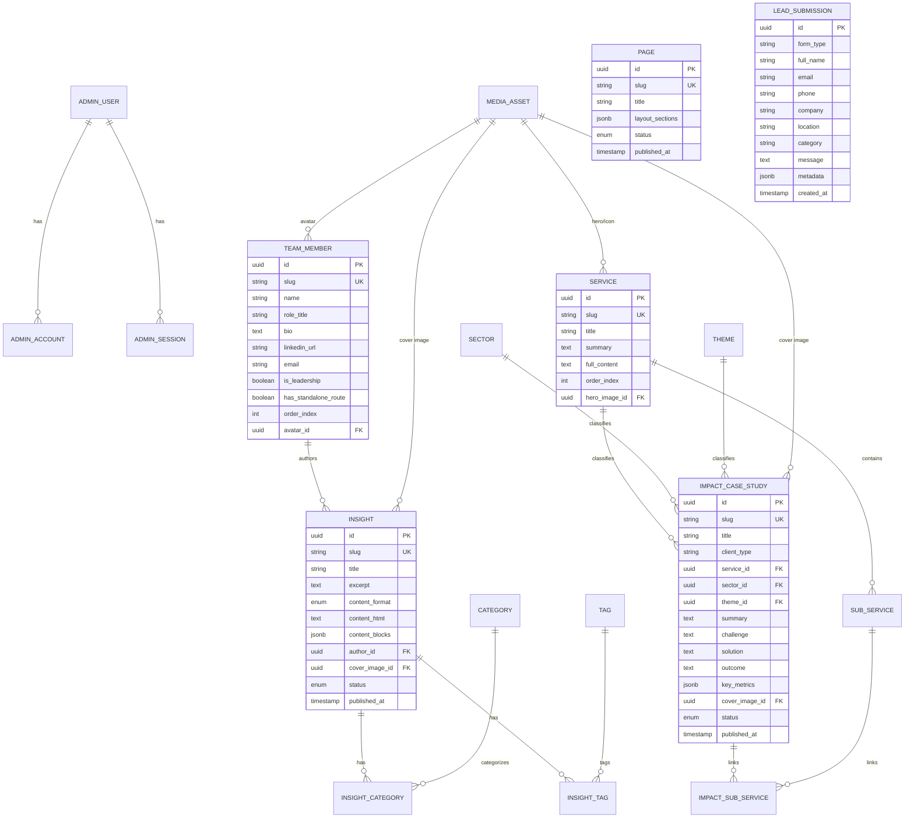

# 04 — Clean Neon PostgreSQL Content Model

This specification defines the normalized, strongly-typed relational schema in **Neon PostgreSQL** designed for high query performance, zero runtime overhead, and strict type safety with **Drizzle ORM** (or Prisma).

---

## 1. Schema Design Principles

1. **Reject EAV / `wp_postmeta` Anti-Pattern:** WordPress stores arbitrary key-value pairs across unindexed rows. In Neon, every entity has explicit typed columns, foreign keys, and indexes.
2. **Explicit Content Format Discriminator:**
   - The schema distinguishes legacy migrated content from newly authored CMS content via a typed enum: `content_format: 'HTML' | 'BLOCKS'`.
   - **Migrated Historical Content:** `content_format = 'HTML'` where sanitized `content_html` is the sole canonical representation, guaranteeing 100% markup fidelity without corruption from lossy markdown conversion.
   - **Newly Authored CMS Content:** `content_format = 'BLOCKS'` where structured `content_blocks` JSON is the sole canonical representation.
   - The frontend renderer inspects `content_format` to choose the appropriate component. Two independently editable canonical representations of the same article are never maintained.
3. **Relational Taxonomies & Multiplicity:**
   - **Impact $\leftrightarrow$ Sub-Service (Many-to-Many):** 7 impact studies belong to more than one sub-service (e.g. `esap` + `esg-dd`). Modeled via the `impact_sub_services` junction table.
   - **Impact $\leftrightarrow$ Service, Sector, Theme (Many-to-One):** In source data, each impact study belongs to exactly one primary Service, Sector, and Theme. Modeled via direct foreign keys.
   - **Insight $\leftrightarrow$ Category, Tag (Many-to-Many):** Modeled via `insight_categories` and `insight_tags` junction tables.
4. **Accessible Alt-Text Model:**
   - Informational images require descriptive `alt_text`.
   - Decorative images specify `is_decorative = TRUE`, rendering `alt=""` according to W3C accessibility guidelines. Contextual alt overrides are supported on individual relation links.
5. **Google OAuth & Auth.js Schema:**
   - Authentication is managed via Google OAuth with an explicit email allowlist (`ALLOWED_ADMIN_EMAILS`) and server-side RBAC. No local password hashes are stored.

---

## 2. Entity-Relationship Diagram (Mermaid)



---

## 3. Detailed Model Definitions

### 3.1 `pages` (Core & Campaign Pages)
Corresponds to the 16 core static pages + 1 campaign page (`/connect-gbc2024/`).

```sql
CREATE TYPE content_status AS ENUM ('DRAFT', 'PUBLISHED', 'ARCHIVED');

CREATE TABLE pages (
    id UUID PRIMARY KEY DEFAULT gen_random_uuid(),
    slug VARCHAR(150) UNIQUE NOT NULL,
    title VARCHAR(255) NOT NULL,
    h1_heading VARCHAR(255),
    layout_template VARCHAR(100) NOT NULL, -- 'HomeTemplate', 'AboutTemplate', 'ServicesLandingTemplate', 'CampaignLandingTemplate', etc.
    content_blocks JSONB NOT NULL DEFAULT '[]'::jsonb,
    status content_status NOT NULL DEFAULT 'DRAFT',
    
    -- SEO Metadata
    seo_title VARCHAR(255),
    seo_description TEXT,
    canonical_url VARCHAR(500),
    og_image_url VARCHAR(500),
    no_index BOOLEAN NOT NULL DEFAULT FALSE,
    
    created_at TIMESTAMPTZ NOT NULL DEFAULT NOW(),
    updated_at TIMESTAMPTZ NOT NULL DEFAULT NOW(),
    published_at TIMESTAMPTZ
);

CREATE INDEX idx_pages_slug ON pages(slug);
CREATE INDEX idx_pages_status ON pages(status);
```

---

### 3.2 `insights` (54 Published Articles)

```sql
CREATE TYPE content_format_type AS ENUM ('HTML', 'BLOCKS');

CREATE TABLE insights (
    id UUID PRIMARY KEY DEFAULT gen_random_uuid(),
    slug VARCHAR(200) UNIQUE NOT NULL,
    title VARCHAR(300) NOT NULL,
    excerpt TEXT,
    
    -- Explicit Format Discriminator
    content_format content_format_type NOT NULL DEFAULT 'HTML',
    content_html TEXT, -- Canonical when content_format = 'HTML'
    content_blocks JSONB, -- Canonical when content_format = 'BLOCKS'
    
    reading_time_minutes INT DEFAULT 5,
    author_id UUID REFERENCES team_members(id) ON DELETE SET NULL,
    cover_image_id UUID REFERENCES media_assets(id) ON DELETE SET NULL,
    status content_status NOT NULL DEFAULT 'DRAFT',
    
    -- SEO Metadata
    seo_title VARCHAR(255),
    seo_description TEXT,
    canonical_url VARCHAR(500),
    og_image_url VARCHAR(500),
    no_index BOOLEAN NOT NULL DEFAULT FALSE,
    
    created_at TIMESTAMPTZ NOT NULL DEFAULT NOW(),
    updated_at TIMESTAMPTZ NOT NULL DEFAULT NOW(),
    published_at TIMESTAMPTZ
);

CREATE INDEX idx_insights_slug ON insights(slug);
CREATE INDEX idx_insights_status_published ON insights(status, published_at DESC);
```

---

### 3.3 `impact_case_studies` & `impact_sub_services` (26 Case Studies)

```sql
CREATE TABLE impact_case_studies (
    id UUID PRIMARY KEY DEFAULT gen_random_uuid(),
    slug VARCHAR(200) UNIQUE NOT NULL,
    title VARCHAR(300) NOT NULL,
    client_type VARCHAR(200),
    summary TEXT NOT NULL,
    challenge TEXT,
    solution TEXT,
    outcome TEXT,
    key_metrics JSONB DEFAULT '[]'::jsonb,
    
    -- Many-to-One Taxonomy Relations (Source Multiplicity = 1)
    service_id UUID REFERENCES services(id) ON DELETE SET NULL,
    sector_id UUID REFERENCES sectors(id) ON DELETE SET NULL,
    theme_id UUID REFERENCES themes(id) ON DELETE SET NULL,
    
    cover_image_id UUID REFERENCES media_assets(id) ON DELETE SET NULL,
    status content_status NOT NULL DEFAULT 'DRAFT',
    order_index INT NOT NULL DEFAULT 0,
    
    -- SEO Metadata
    seo_title VARCHAR(255),
    seo_description TEXT,
    canonical_url VARCHAR(500),
    og_image_url VARCHAR(500),
    no_index BOOLEAN NOT NULL DEFAULT FALSE,
    
    created_at TIMESTAMPTZ NOT NULL DEFAULT NOW(),
    updated_at TIMESTAMPTZ NOT NULL DEFAULT NOW(),
    published_at TIMESTAMPTZ
);

-- Many-to-Many Junction Table for Sub-Services
CREATE TABLE impact_sub_services (
    impact_id UUID NOT NULL REFERENCES impact_case_studies(id) ON DELETE CASCADE,
    sub_service_id UUID NOT NULL REFERENCES sub_services(id) ON DELETE CASCADE,
    PRIMARY KEY (impact_id, sub_service_id)
);

CREATE INDEX idx_impact_slug ON impact_case_studies(slug);
CREATE INDEX idx_impact_service ON impact_case_studies(service_id);
CREATE INDEX idx_impact_sector ON impact_case_studies(sector_id);
CREATE INDEX idx_impact_theme ON impact_case_studies(theme_id);
```

---

### 3.4 `services` & `sub_services`

```sql
CREATE TABLE services (
    id UUID PRIMARY KEY DEFAULT gen_random_uuid(),
    slug VARCHAR(100) UNIQUE NOT NULL,
    title VARCHAR(200) NOT NULL,
    tagline VARCHAR(300),
    summary TEXT NOT NULL,
    full_description TEXT NOT NULL,
    key_offerings JSONB NOT NULL DEFAULT '[]'::jsonb,
    icon_name VARCHAR(100),
    hero_image_id UUID REFERENCES media_assets(id) ON DELETE SET NULL,
    order_index INT NOT NULL DEFAULT 0,
    
    -- SEO Metadata
    seo_title VARCHAR(255),
    seo_description TEXT,
    canonical_url VARCHAR(500),
    og_image_url VARCHAR(500),
    
    created_at TIMESTAMPTZ NOT NULL DEFAULT NOW(),
    updated_at TIMESTAMPTZ NOT NULL DEFAULT NOW()
);

CREATE TABLE sub_services (
    id UUID PRIMARY KEY DEFAULT gen_random_uuid(),
    service_id UUID NOT NULL REFERENCES services(id) ON DELETE CASCADE,
    slug VARCHAR(100) UNIQUE NOT NULL,
    title VARCHAR(200) NOT NULL,
    description TEXT,
    order_index INT NOT NULL DEFAULT 0,
    created_at TIMESTAMPTZ NOT NULL DEFAULT NOW()
);
```

---

### 3.5 `team_members` (15 Members)

```sql
CREATE TABLE team_members (
    id UUID PRIMARY KEY DEFAULT gen_random_uuid(),
    slug VARCHAR(100) UNIQUE NOT NULL,
    name VARCHAR(200) NOT NULL,
    role_title VARCHAR(200) NOT NULL,
    bio TEXT NOT NULL,
    short_bio VARCHAR(300),
    avatar_id UUID REFERENCES media_assets(id) ON DELETE SET NULL,
    linkedin_url VARCHAR(500),
    twitter_url VARCHAR(500),
    email VARCHAR(200),
    is_leadership BOOLEAN NOT NULL DEFAULT TRUE,
    has_standalone_route BOOLEAN NOT NULL DEFAULT TRUE, -- TRUE for 14 public routes, FALSE for Anand (featured on About)
    order_index INT NOT NULL DEFAULT 0,
    status content_status NOT NULL DEFAULT 'PUBLISHED',
    
    -- SEO Metadata
    seo_title VARCHAR(255),
    seo_description TEXT,
    
    created_at TIMESTAMPTZ NOT NULL DEFAULT NOW(),
    updated_at TIMESTAMPTZ NOT NULL DEFAULT NOW()
);

CREATE INDEX idx_team_members_slug ON team_members(slug);
CREATE INDEX idx_team_members_order ON team_members(order_index ASC);
```

---

### 3.6 Taxonomies: `sectors`, `themes`, `categories`, `tags`

```sql
CREATE TABLE sectors (
    id UUID PRIMARY KEY DEFAULT gen_random_uuid(),
    slug VARCHAR(100) UNIQUE NOT NULL,
    name VARCHAR(150) NOT NULL,
    description TEXT,
    created_at TIMESTAMPTZ NOT NULL DEFAULT NOW()
);

CREATE TABLE themes (
    id UUID PRIMARY KEY DEFAULT gen_random_uuid(),
    slug VARCHAR(100) UNIQUE NOT NULL,
    name VARCHAR(150) NOT NULL,
    description TEXT,
    created_at TIMESTAMPTZ NOT NULL DEFAULT NOW()
);

CREATE TABLE categories (
    id UUID PRIMARY KEY DEFAULT gen_random_uuid(),
    slug VARCHAR(100) UNIQUE NOT NULL,
    name VARCHAR(150) NOT NULL,
    description TEXT,
    created_at TIMESTAMPTZ NOT NULL DEFAULT NOW()
);

CREATE TABLE tags (
    id UUID PRIMARY KEY DEFAULT gen_random_uuid(),
    slug VARCHAR(100) UNIQUE NOT NULL,
    name VARCHAR(150) NOT NULL,
    created_at TIMESTAMPTZ NOT NULL DEFAULT NOW()
);

-- Junction Tables for Insights
CREATE TABLE insight_categories (
    insight_id UUID NOT NULL REFERENCES insights(id) ON DELETE CASCADE,
    category_id UUID NOT NULL REFERENCES categories(id) ON DELETE CASCADE,
    PRIMARY KEY (insight_id, category_id)
);

CREATE TABLE insight_tags (
    insight_id UUID NOT NULL REFERENCES insights(id) ON DELETE CASCADE,
    tag_id UUID NOT NULL REFERENCES tags(id) ON DELETE CASCADE,
    PRIMARY KEY (insight_id, tag_id)
);
```

---

### 3.7 `media_assets` (AWS S3 & Alt-Text Model)

```sql
CREATE TABLE media_assets (
    id UUID PRIMARY KEY DEFAULT gen_random_uuid(),
    filename VARCHAR(255) NOT NULL,
    s3_key VARCHAR(500) NOT NULL UNIQUE,
    url VARCHAR(1000) NOT NULL,
    alt_text VARCHAR(300) DEFAULT '',
    is_decorative BOOLEAN NOT NULL DEFAULT FALSE, -- If TRUE, renders alt=""
    mime_type VARCHAR(100) NOT NULL,
    file_size_bytes INT NOT NULL,
    width INT,
    height INT,
    created_at TIMESTAMPTZ NOT NULL DEFAULT NOW(),
    updated_at TIMESTAMPTZ NOT NULL DEFAULT NOW()
);

CREATE INDEX idx_media_s3_key ON media_assets(s3_key);
```

---

### 3.8 `lead_submissions` (Contact & Event Leads)

```sql
CREATE TABLE lead_submissions (
    id UUID PRIMARY KEY DEFAULT gen_random_uuid(),
    form_type VARCHAR(50) NOT NULL, -- 'CONTACT', 'NEWSLETTER_ESQ', 'EVENT_GBC'
    full_name VARCHAR(200),
    email VARCHAR(200) NOT NULL,
    phone VARCHAR(50),
    company VARCHAR(200),
    location VARCHAR(200),
    category VARCHAR(100),
    message TEXT,
    ip_address VARCHAR(100),
    user_agent TEXT,
    metadata JSONB DEFAULT '{}'::jsonb,
    is_processed BOOLEAN NOT NULL DEFAULT FALSE,
    created_at TIMESTAMPTZ NOT NULL DEFAULT NOW()
);

CREATE INDEX idx_lead_submissions_created ON lead_submissions(created_at DESC);
CREATE INDEX idx_lead_submissions_type ON lead_submissions(form_type);
```

---

### 3.9 Auth.js (NextAuth v5) Google OAuth Schema

```sql
CREATE TYPE admin_role AS ENUM ('SUPER_ADMIN', 'EDITOR');

CREATE TABLE admin_users (
    id UUID PRIMARY KEY DEFAULT gen_random_uuid(),
    name VARCHAR(255),
    email VARCHAR(255) UNIQUE NOT NULL,
    email_verified TIMESTAMPTZ,
    image TEXT,
    role admin_role NOT NULL DEFAULT 'EDITOR',
    is_active BOOLEAN NOT NULL DEFAULT TRUE,
    created_at TIMESTAMPTZ NOT NULL DEFAULT NOW(),
    updated_at TIMESTAMPTZ NOT NULL DEFAULT NOW()
);

CREATE TABLE admin_accounts (
    id UUID PRIMARY KEY DEFAULT gen_random_uuid(),
    user_id UUID NOT NULL REFERENCES admin_users(id) ON DELETE CASCADE,
    type VARCHAR(255) NOT NULL,
    provider VARCHAR(255) NOT NULL, -- 'google'
    provider_account_id VARCHAR(255) NOT NULL,
    refresh_token TEXT,
    access_token TEXT,
    expires_at BIGINT,
    token_type VARCHAR(255),
    scope TEXT,
    id_token TEXT,
    session_state TEXT,
    UNIQUE (provider, provider_account_id)
);

CREATE TABLE admin_sessions (
    id UUID PRIMARY KEY DEFAULT gen_random_uuid(),
    session_token VARCHAR(255) UNIQUE NOT NULL,
    user_id UUID NOT NULL REFERENCES admin_users(id) ON DELETE CASCADE,
    expires TIMESTAMPTZ NOT NULL
);

CREATE TABLE admin_verification_tokens (
    identifier VARCHAR(255) NOT NULL,
    token VARCHAR(255) NOT NULL,
    expires TIMESTAMPTZ NOT NULL,
    PRIMARY KEY (identifier, token)
);
```
