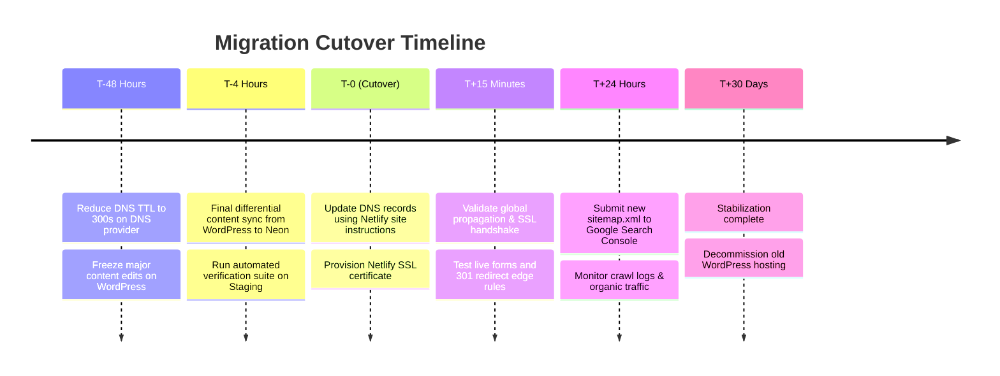

# 08 — Testing, Validation & Zero-Downtime Cutover Strategy

This document outlines the complete automated verification protocol, differential comparison tooling, and step-by-step DNS cutover and rollback plan for **Envint**.

---

## 1. Automated Verification & Quality Assurance Suite

Before any DNS change, an automated test runner validates the staging site against the captured production baseline across 18 critical dimensions:

| # | Test Area | Verification Criteria | Automated Tool / Script |
| :--- | :--- | :--- | :--- |
| 1 | **URL Parity** | All 150 finalized KEEP URLs return HTTP 200 on staging. | `scripts/test-url-parity.ts` |
| 2 | **Redirect Verification** | All 14 redirect rules return HTTP 301 and match destination. | `scripts/test-redirects.ts` |
| 3 | **Route Removal Verification** | 2 obsolete Elementor HF routes return HTTP 410 Gone (`/elementor-hf/*`). | `scripts/test-410-status.ts` |
| 4 | **HTTP Status Integrity** | 0 unexpected 404s, 500s, or crawl anomalies. | `scripts/test-http-status.ts` |
| 5 | **Title Tag Parity** | 1:1 match with historical titles (except approved fixes). | `scripts/test-seo-parity.ts` |
| 6 | **Meta Description Parity** | 1:1 match with historical descriptions. | `scripts/test-seo-parity.ts` |
| 7 | **Canonical Tag Parity** | Every page declares self-referencing canonical URL matching trailing slash format. | `scripts/test-canonicals.ts` |
| 8 | **Robots Directives** | Staging enforces `noindex`; production configuration enforces `index, follow`. | `scripts/test-robots.ts` |
| 9 | **H1 Tag Presence** | 100% of pages contain exactly one semantic `<h1>`. | `scripts/test-headings.ts` |
| 10 | **Schema.org Validation** | Valid JSON-LD graphs for WebSite, Article, Person, Service. | `@schema-org/validator` |
| 11 | **Internal Link Health** | 0 broken internal links across all active pages. | `link-checker` / Playwright |
| 12 | **Media & Asset Health** | 0 broken image references; master images resolve via Netlify Image CDN. | Playwright network interceptor |
| 13 | **Image Alt Text Compliance** | All informational images have descriptive alt text; decorative images have `alt=""`. | `scripts/test-alt-text.ts` |
| 14 | **Desktop Visual Regression** | Screenshot pixel diff within acceptable tolerance against baseline. | Playwright visual comparison |
| 15 | **Mobile Visual Regression** | Screenshot pixel diff within acceptable tolerance against baseline. | Playwright visual comparison |
| 16 | **Lead Form Functionality** | Contact, Newsletter, and Event forms record submissions in Neon & trigger alerts. | E2E form test suite |
| 17 | **Accessibility (WCAG AA)** | 0 automated violations via Axe-core (`@axe-core/playwright`). | Axe accessibility audit |
| 18 | **XML Sitemap & LLMS** | Valid XML sitemap covering all 150 KEEP routes, and valid `/llms.txt`. | Sitemap validator |

---

## 2. Step-by-Step Zero-Downtime Cutover Plan

### 2.1 Detailed Cutover Execution Steps

1. **T-48 Hours — DNS TTL Reduction:**
   - In DNS provider (GoDaddy), lower TTL on `envintglobal.com` `@` and `www` records from `86400` (1 day) to `300` (5 minutes).
2. **T-4 Hours — Final Content Snapshot:**
   - Run differential sync script to extract any newly published articles from WordPress into Neon PostgreSQL.
   - Verify master images uploaded to AWS S3.
3. **T-1 Hour — Staging Sign-Off:**
   - Execute full Playwright E2E and visual regression test suite against staging URL.
4. **T-0 — DNS Cutover:**
   - Check Netlify's domain management settings for the created production site to retrieve the exact current DNS target records.
   - Update DNS records:
     - Apex record (`@`): Point to Netlify's designated load balancer IP / ALIAS.
     - `www` record: CNAME to the designated Netlify site endpoint.
     - `admin` subdomain: CNAME to the Admin CMS deployment.
5. **T+5 Minutes — SSL Provisioning:**
   - Netlify verifies DNS and issues Let's Encrypt SSL certificate.
6. **T+15 Minutes — Edge Sanity Checks:**
   - Verify SSL handshake across browsers.
   - Test live contact form submissions to confirm email delivery and Neon lead capture.
   - Test 301 redirects and 410 removals at the edge.
7. **T+24 Hours — Search Console Verification:**
   - Submit new `https://envintglobal.com/sitemap.xml` in Google Search Console.
   - Monitor Google Search Console "Indexing" and "Page Experience" reports for any crawl errors.

---

## 3. Rollback & Safety Plan

The existing WordPress site on GoDaddy hosting remains **100% untouched and fully operational** throughout the migration process.

### Emergency Rollback Procedure:
1. **Action:** If critical defects emerge during cutover, revert DNS `@` and `www` records in GoDaddy back to the original hosting server IP.
2. **Propagation:** Pre-reduced 300s DNS TTL enables rapid traffic redirection back to WordPress.
3. **Lead Reconciliation:** Any leads captured in Neon during the cutover window will be exported to CSV and delivered to `connect@envintglobal.com`.
4. **Decommissioning Policy:**
   - GoDaddy WordPress hosting will **not** be cancelled or modified until a 30-day post-launch stabilization window has passed with zero critical issues.
